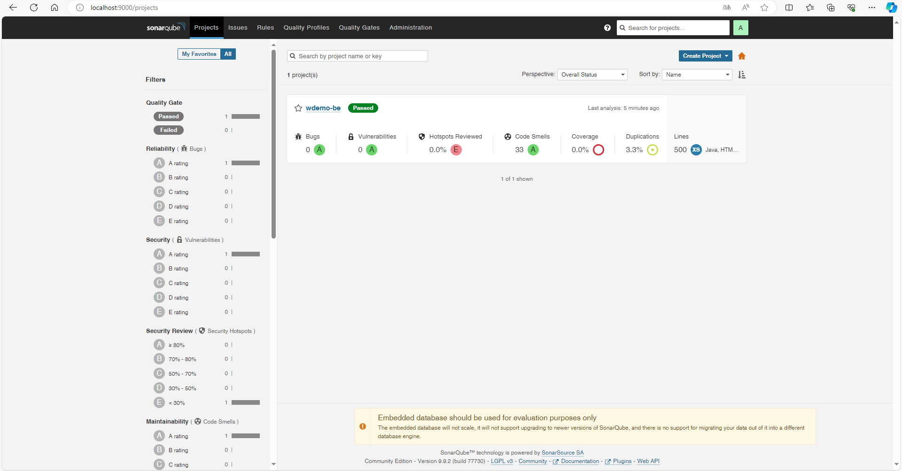
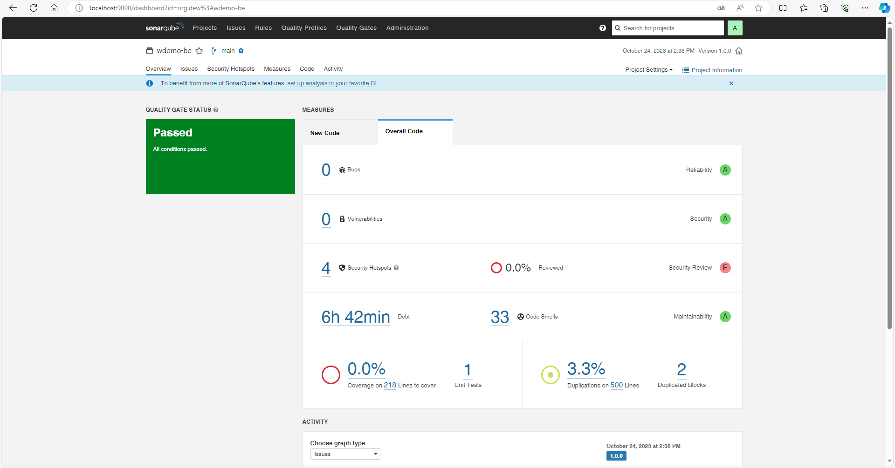
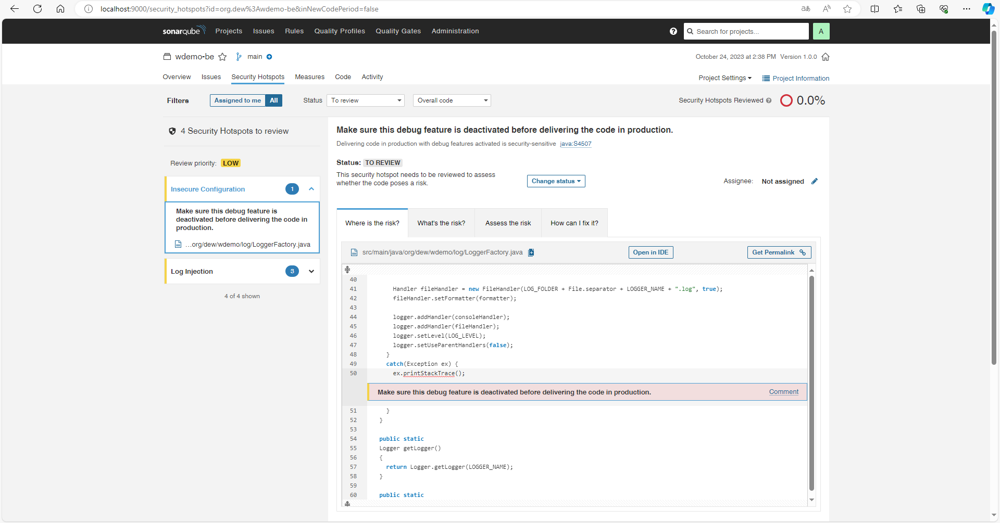
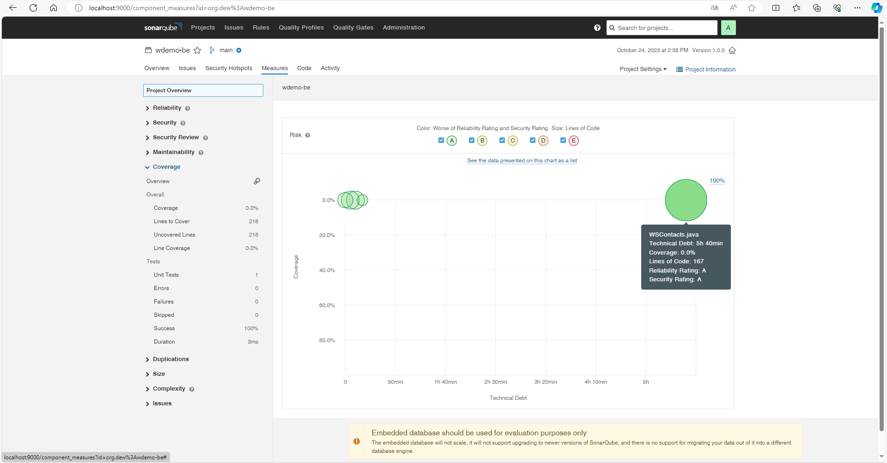

# WDemo - Installation of SonarQube

## Install SonarQube with Docker

`docker pull sonarqube:9.9.2-community`

`docker run --name sonarqube -p 9000:9000 -d sonarqube:9.9.2-community`

## Install SonarQube with Kubernetes

`kubectl apply -f sonarqube.yaml`

Add to hosts file:

`127.0.0.1  sonarqube.dew.org`

Please wait several minutes before logging in to `http://sonarqube.dew.org`.

## First login

user: admin

passowrd: admin

## Maven configuration

First generate a `User token` from:

`http://localhost:9000/account/security`

In `$HOME/.m2/settings.xml` add:

```xml
<settings>
  
  <pluginGroups>
    <pluginGroup>org.sonarsource.scanner.maven</pluginGroup>
  </pluginGroups>
  
  <profiles>
    <profile>
      <id>sonar</id>
      <activation>
        <activeByDefault>true</activeByDefault>
      </activation>
      <properties>
        <sonar.host.url>
          http://localhost:9000
        </sonar.host.url>
        <sonar.login>
          <!-- generated user token -->
          squ_68f0eec6132a9f76af1a437fdaf96fc666970660
        </sonar.login>
      </properties>
    </profile>
  </profiles>

</settings>
```

In the end launch SonarQube analysis:

`mvn clean verify sonar:sonar`

If you define mvn2 as a well configured mvn:

`mvn2 clean verify sonar:sonar`

## Consult the analysis report






## Contributors

* [Giorgio Silvestris](https://github.com/giosil)
