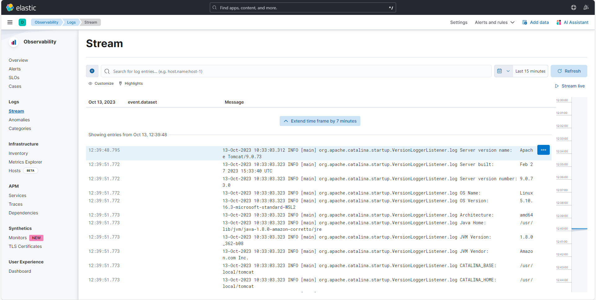

# WDemo - Installation of Elastic Stack ELK: Elasticsearch, Logstash and Kibana.

## Install Elasticsearch

`helm install elasticsearch-dew bitnami/elasticsearch`

Wait a few minutes and check installation:

`helm status elasticsearch-dew`

`kubectl port-forward --namespace default svc/elasticsearch-dew 9200:9200`

`wget http://localhost:9200`

`wget http://localhost:9200/_cat/indices?v=true&s=index`

`wget http://localhost:9200/_cat/indices?format=json`

## Install Kibana

`helm install kibana-dew bitnami/kibana --set elasticsearch.hosts[0]=elasticsearch-dew.default.svc.cluster.local,elasticsearch.port=9200`

Wait a few minutes and check installation:

`helm status kibana-dew`

`kubectl port-forward --namespace default svc/kibana-dew 8080:5601`

`wget http://localhost:8080`

## Install Filebeat on wdemo-be POD based on tomcat

`yum -y install curl`

`yum -y install tar`

`yum -y install gzip`

`yum -y install vim`

`cd /root`

`curl -L -O https://artifacts.elastic.co/downloads/beats/filebeat/filebeat-8.10.3-linux-x86_64.tar.gz`

`tar xzvf filebeat-8.10.3-linux-x86_64.tar.gz`

`cd filebeat-8.10.3-linux-x86_64/`

`vi filebeat.yml`

```yaml
filebeat.inputs:

#...
# wdemo-be logs: /root/log/*.log
# tomcat   logs: /usr/local/tomcat/logs/*.log
  paths:
    - /usr/local/tomcat/logs/*.log
#...

#...
setup.kibana:
  host: "kibana-dew.default.svc.cluster.local:5601"
#...

#...
output.elasticsearch:
  # Array of hosts to connect to.
  hosts: ["elasticsearch-dew.default.svc.cluster.local:9200"]
#...
```

`./filebeat modules enable tomcat`

`vi modules.d/tomcat.yml`

```yaml
#...
- module: tomcat
  log:
    enabled: true
#...
```

`./filebeat -e`

## View log on kibana



## Install Logstash

Check file `logstash-values.yaml`

```yaml
extraEnvVars:
  - name: ELASTICSEARCH_HOST
    value: "elasticsearch-dew.default.svc.cluster.local"

input: |-
  http { port => 8080 }
  beats { port => 5044 }

output: |-
  elasticsearch {
    hosts => ["http://elasticsearch-dew.default.svc.cluster.local:9200"]
    index => "%{[@metadata][beat]}-%{[@metadata][version]}"
    action => "create"
  }

containerPorts:
  - name: http
    containerPort: 8080
    protocol: TCP
  - name: monitoring
    containerPort: 9600
    protocol: TCP
  - name: beats
    containerPort: 5044
    protocol: TCP

service:
  ports:
    - name: http
      port: 8080
      targetPort: http
      protocol: TCP
    - name: beats
      port: 5044
      targetPort: beats
      protocol: TCP
```

`helm install logstash-dew -f logstash-values.yaml bitnami/logstash`

Wait a few minutes and check installation:

`helm status logstash-dew`

Modify filebeat config:

`vi filebeat.yml`

```yaml
filebeat.inputs:

# Comment output.elasticsearch and hosts
#output.elasticsearch:
  # Array of hosts to connect to.
  #hosts: ["elasticsearch-dew.default.svc.cluster.local:9200"]
#...

#...
output.logstash:
  # The Logstash hosts
  hosts: ["logstash-dew.default.svc.cluster.local:5044"]
#...
```

## Uninstall

`helm uninstall logstash-dew`

`helm uninstall kibana-dew`

`helm uninstall elasticsearch-dew`

## Contributors

* [Giorgio Silvestris](https://github.com/giosil)
