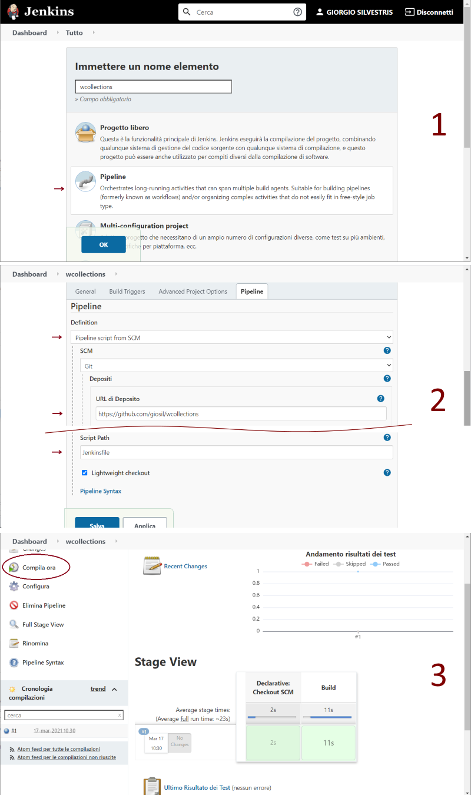

# WDemo - Jenkins

## Install Jenkins with Helm and Kubernetes (run as root)

- `helm repo add bitnami https://charts.bitnami.com/bitnami`

In `jenkins-values.yaml` added ingress configuration and container security context (run as root):

- `helm install jenkins-dew -f jenkins-values.yaml bitnami/jenkins`

- `helm status jenkins-dew`

- `helm get notes jenkins-dew`

Other commands:

- `helm uninstall jenkins-dew`

- `helm repo update`

- `helm search repo bitnami`

- `helm list`

## Install Jekins locally on AS

Last LTS version with Java 8 support.

`https://get.jenkins.io/war-stable/2.346.3/`

## Run Jenkins

Add to hosts file:

`127.0.0.1	jenkins.dew.org`

First get jenkins-password of user `user` from secret.

- `kubectl get secret jenkins-dew --namespace default -o jsonpath='{.data.jenkins-password}'`

The password is base64 encoded.

To decode Base64 encoded text in Powershell:

- `$B64 = 'WDQ2NG9xNW9rMw=='`
- `$DEC = [System.Text.Encoding]::UTF8.GetString([System.Convert]::FromBase64String($B64))`
- `Write-Output $DEC`

To decode Base64 encoded text in Linux:

- `echo WDQ2NG9xNW9rMw== | base64 -d`

## Plugins to run pipeline with Maven / JUnit

Install these plugins in Jenkins web application:

- `Pipeline`
- `Pipeline: Stage View Plugin`
- `Git`
- `JUnit Plugin`

## Install Maven and Ant on Jenkins Pod (root)

- `apt-get update`

- `apt-get install -y maven`

- `apt-get install -y ant`

Check maven installation:

`mvn --version`

Now, in Jenkinsfile you can write:

`sh "mvn clean package"`

## Example of Pipeline

See [wcollections](https://github.com/giosil/wcollections) project.



```
pipeline {
    agent any
    
    stages {
        stage('Build') {
           steps {
               // git 'https://github.com/giosil/wcollections.git'
               
               checkout scm
               
               script {
                  if (isUnix()) {
                      sh "mvn clean package"
                  } else {
                      bat "mvn clean package"
                  }
               }
           }
           
           post {
               always {
                   junit '**/target/surefire-reports/TEST-*.xml'
               }
           }
        }
    }
}
```