# WDemo - WSO2

## Install with Docker

- `docker pull wso2/wso2am`
- `docker run -it -p 8280:8280 -p 8243:8243 -p 9443:9443 --name api-manager wso2/wso2am:latest`

Launch:

- `https://localhost:9443/carbon` 
- `https://localhost:9443/publisher` 
- `https://localhost:9443/devportal` 

## Install with Kubernetes

Create Kubernetes application

- `kubectl apply -f wso2.yaml`

- `kubectl port-forward deployment/wso2 8280:8280` - API Manager (HTTP)
- `kubectl port-forward deployment/wso2 8243:8243` - API Manager (HTTPS)
- `kubectl port-forward deployment/wso2 9443:9443` - Publisher / Carbon / DevPortal

Delete Kubernetes application

- `kubectl delete -f wso2.yaml`

## Import API

Add to hosts file:

127.0.0.1	gwapi.dew.org

Wait a few seconds for the application to start.

Check APIM:

- `http://gwapi.dew.org`

Launch WSO2 Publisher:

- `https://localhost:9443/publisher`

Use admin / admin to login.

To deploy RPC Endpoint, import API from file `wdemo-api-docs.yaml`, deploy API and try out on HTTP (8280).

RPC Request:

```json
{
  "jsonrpc": "2.0",
  "id": 1,
  "method": "CONTACTS.list",
  "params": []
}
```

To deploy RESTful API, import API from file `wdemo-rest-api-docs.yaml`, deploy API and try out on HTTP (8280).

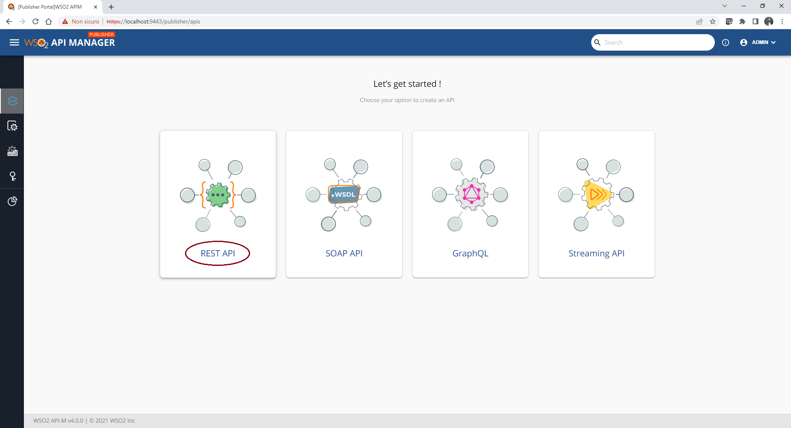
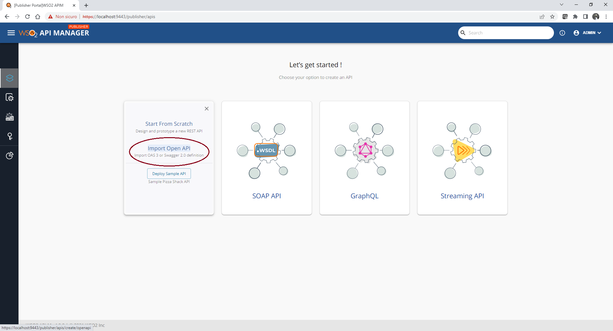

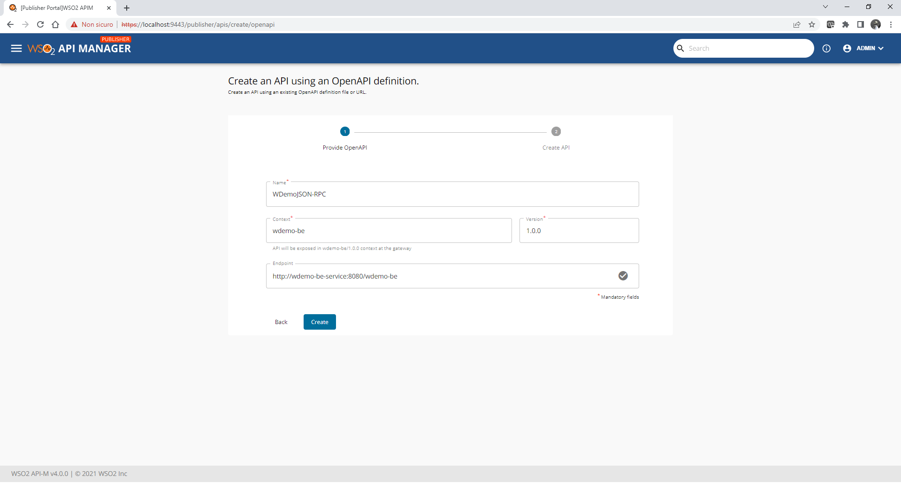
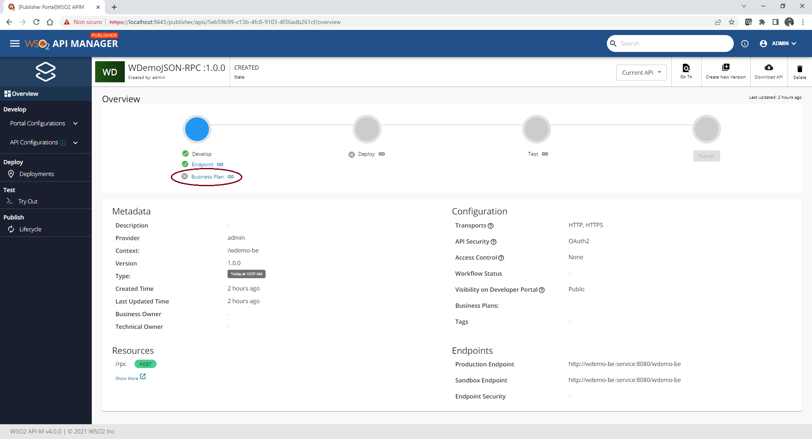
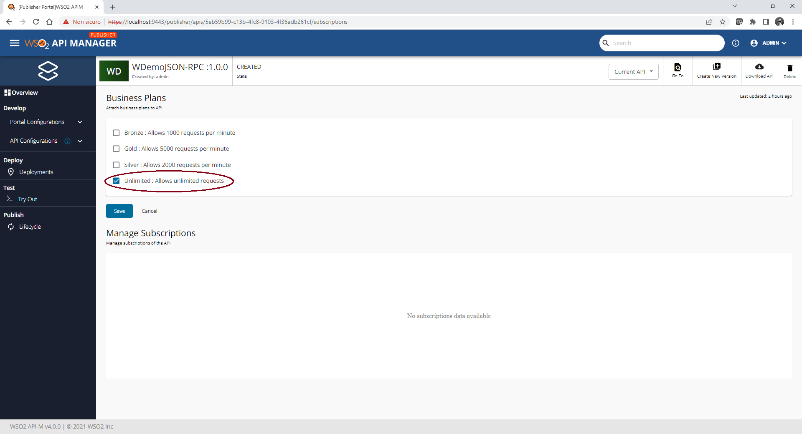
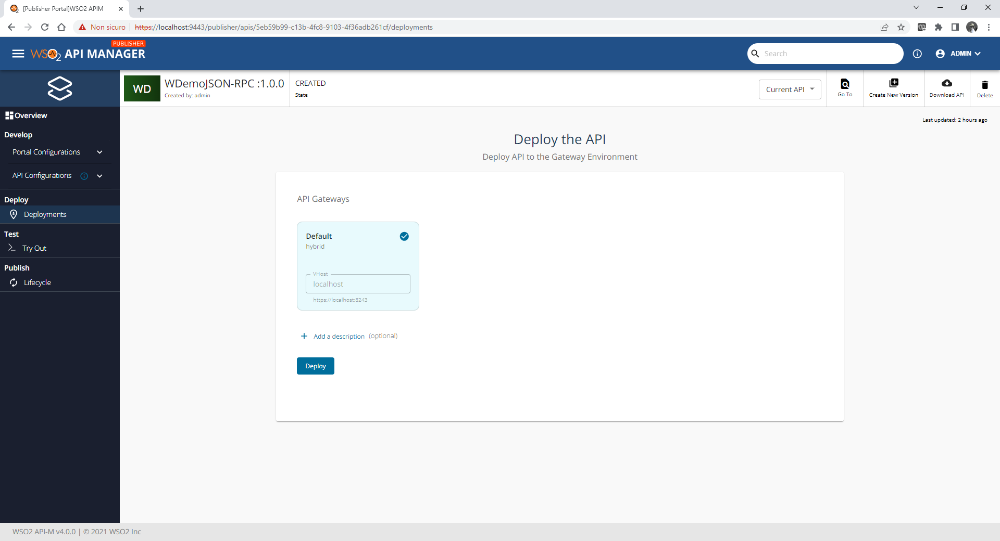
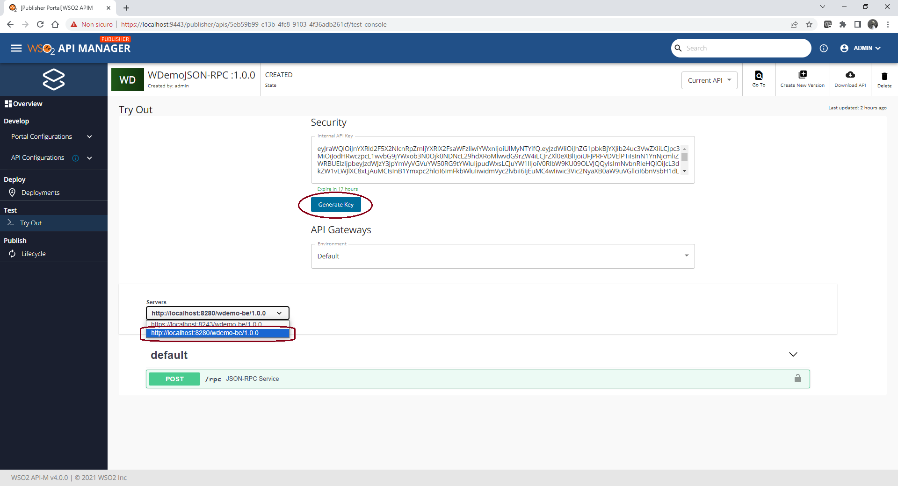
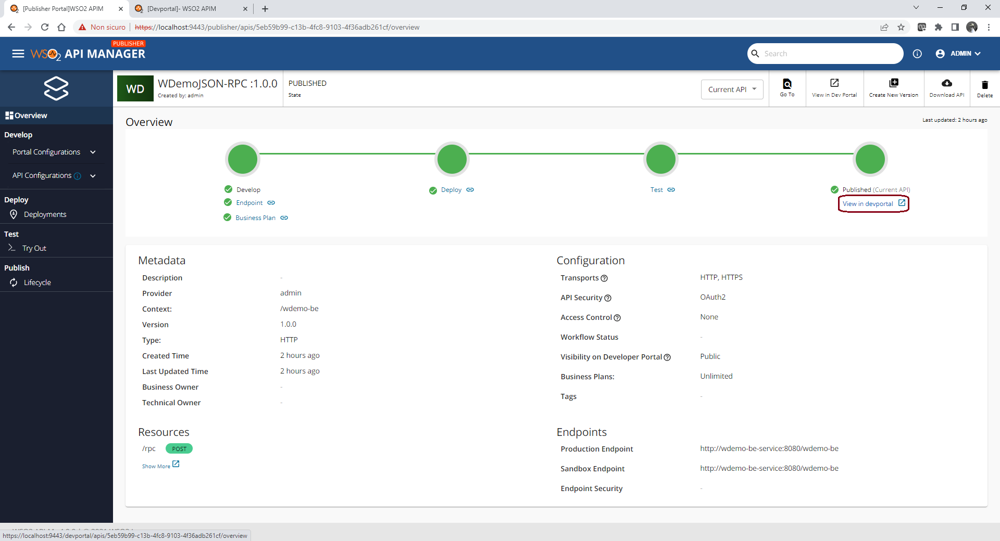
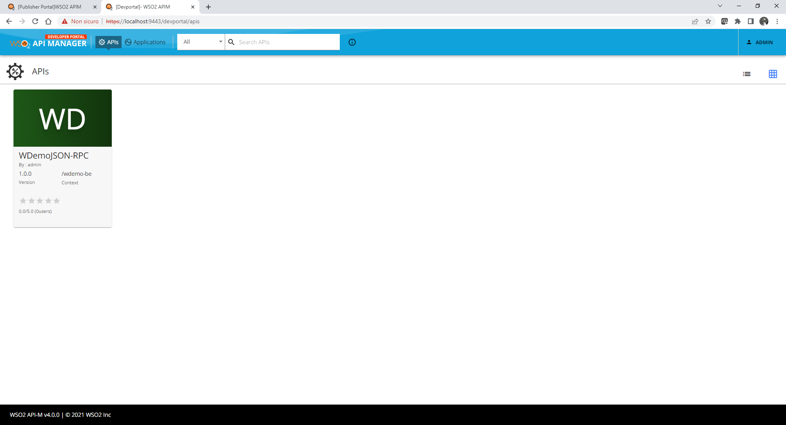
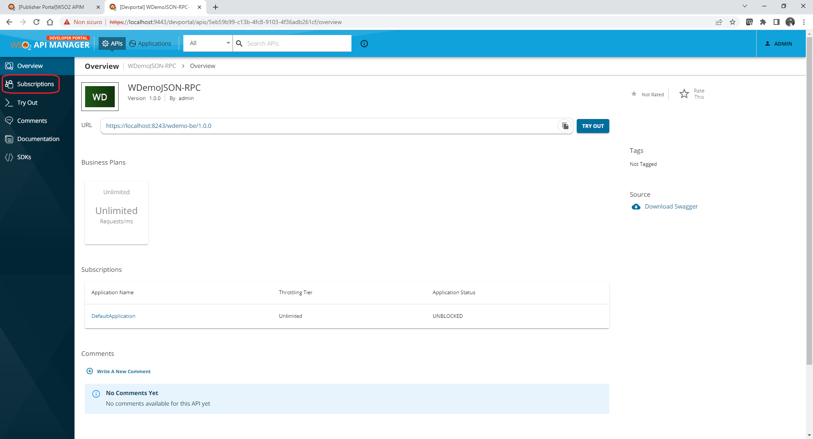
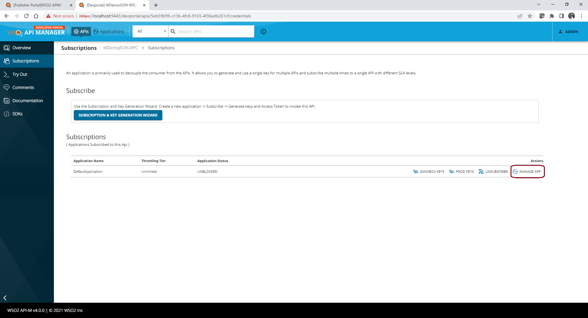
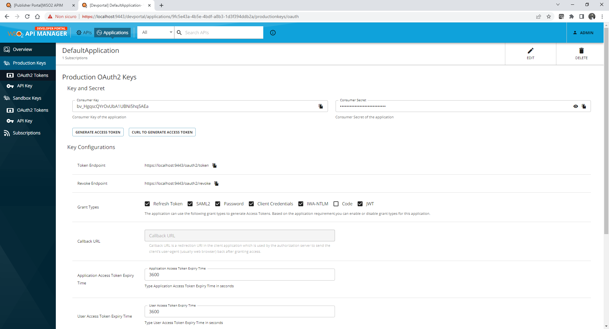
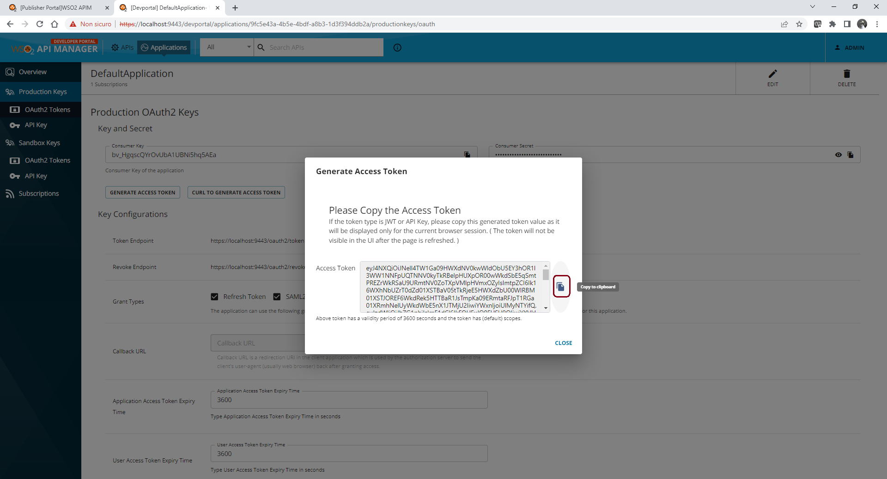
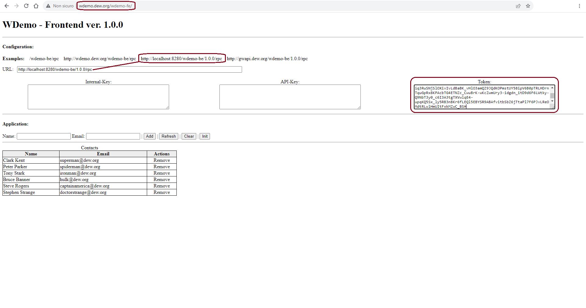

## Contributors

* [Giorgio Silvestris](https://github.com/giosil)
